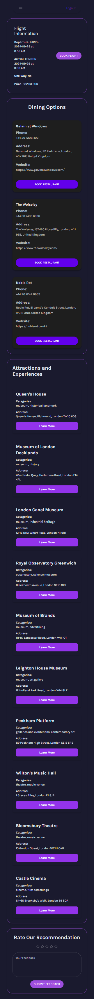

# AI Travel App

## Overview

This project implements an AI travel plan which is a web application that harnesses the power of artificial intelligence to revolutionize the way you plan your travels. By utilizing advanced AI agents, the app provides personalized travel recommendations tailored to your unique preferences and needs.

Whether you’re dreaming of a tropical getaway, an enriching cultural exploration, or a serene mountain retreat, the AI Travel App intelligently analyzes various factors—such as your budget, travel dates, and desired activities—to generate comprehensive and tailored travel itineraries. Join me on this journey to simplify and enhance the way we plan our travels!

## Features

- **User Authentication**: Secure login and registration using JWT.
- **Personalized Recommendations**: AI-powered suggestions based on user preferences.
- **Comprehensive Travel Plans**: Detailed itineraries with options for flights, dining, and activities.
- **Interactive UI**: User-friendly interface built with React.js and MUI components.
- **Responsive Design**: Mobile-friendly layout for an optimal user experience on any device.

## Technologies Used

- **Frontend:** 
  - **React.js** (v18.3) for building dynamic user interfaces
  - **TailwindCSS** (v3.4) for utility-first CSS styling
  - **Material UI** (v6.0) for pre-designed React components
  
- **Backend:** 
  - **Django** (v5.1) for robust web application development
  - **crewai** (v0.63.6) for agents and task management
  
- **Database:** 
  - **PostgreSQL** (v16.4) for reliable data storage and management
  
- **Large Language Model (LLM):** 
  - **Ollama** (Llama 3.1) for agents to use.

## Getting Started

### Prerequisites

- **Node.js** (version 20) and **npm** for frontend development
- **Python** (version 3.12) for backend development
- **PostgreSQL** (version 16.3) for database management

### Setup

#### Frontend

1. Clone the repository:

   ```bash
   git clone https://github.com/YASSINEKS007/AI-Travel-Planner-Django-React.git
   ```

2. Navigate to the frontend directory:

   ```bash
   cd frontend
   ```

3. Install dependencies:

   ```bash
   npm install
   ```

4. Start the development server:

   ```bash
   npm run dev
   ```

   The frontend will be available at [http://localhost:3000](http://localhost:3000).

#### Backend

Make sure you have the following installed:

- [Poetry](https://python-poetry.org/docs/#installation)

1. Navigate to the backend directory:

   ```bash
   cd backend
   ```

2. Install dependencies:

   ```bash
   poetry install
   ```

3. Start the backend server:

   ```bash
   poetry run python manage.py runserver
   ```

   The backend will be available at [http://localhost:8000/](http://localhost:8000/).

#### Database Setup

1. **Configure Database Connection:**

   - Edit the `.env` file to configure your PostgreSQL database connection settings.

2. **Run Database Migrations:**
   - Apply the migrations to set up the database schema:
     ```bash
     poetry run python manage.py makemigrations
     ```
     ```bash
     poetry run python manage.py migrate
     ```

#### LLM Setup

1.  **Install Llama3.1:**

- Follow the instructions from [Ollama's website](https://ollama.com) to install Llama3.1. Ensure it is correctly set up and accessible in your environment.

### Important Note

<div style="background-color: #f8d7da; border-left: 6px solid #f5c6cb; padding: 15px; color: #721c24;">
  <strong>⚠️ Important:</strong><br>
  **Llama3.1 is a local LLM (Large Language Model) that requires significant computing resources.**<br>
  Ensure you have a capable PC, as generating responses may take some time depending on your system's performance.
</div>

### Configuration

#### Frontend

- **File:** `.env`
- **Variable:**
  - `VITE_BACKEND_HOST=`: Set this to the backend host URL.
  - `VITE_GOOGLE_CLIENT_ID=`: Set this to your Google Client ID obtained from the Google Developer Console for OAuth 2.0 authentication.

#### Backend

- **File:** `.env`
- **Variables:**

  - `DJANGO_SECRET_KEY=`: Your Django secret key.
  - `DJANGO_ALLOWED_ORIGINS=`: Comma-separated list of allowed origins for CORS.
  - `DJANGO_ALLOWED_METHODS=`: Comma-separated list of allowed HTTP methods (e.g., GET, POST).
  - `DJANGO_ALLOWED_HEADERS=`: Comma-separated list of allowed headers.

  - **Database Configuration:**
    - `DB_NAME=`: Name of the PostgreSQL database.
    - `DB_USER=`: Username for the PostgreSQL database.
    - `DB_PASSWORD=`: Password for the PostgreSQL database.
    - `DB_HOST=`: Host of the PostgreSQL database server.
    - `DB_PORT=`: Port number for the PostgreSQL database server.

- API Keys

- **`grant_type`**: The type of grant used for authentication with the Amadeus Travel API. More details can be found in the [Amadeus API documentation](https://developers.amadeus.com/).
  
- **`client_id`**: The unique identifier for your application when accessing the Amadeus Travel API. You can find it in the [Amadeus API documentation](https://developers.amadeus.com/).

- **`client_secret`**: A confidential key associated with your application, required for authenticating requests to the Amadeus Travel API. Refer to the [Amadeus API documentation](https://developers.amadeus.com/) for more information.

- **`hotel_api_key`**: The API key for accessing the Geoapify service, which provides hotel and activities data and other location-based services. More information is available at [Geoapify](https://www.geoapify.com/).


## Usage

1. **Register:** Create an account on the platform to get started.

2. **Explore the Pages:** Navigate through various sections of the platform to familiarize yourself with its features.

3. **Generate Recommendation:** Go to the Recommendations page, enter your preferences, and click the "Generate Plan" button.

4. **View Generated Response:** Your generated plan will appear in a section below the form.

5. **Explore Generated Plan:** Click on the generated plan card to view recommended flights, dining options, and activities.

## Screenshots

### Main Page

  
_Overview of the main application interface where users can interact with the system._

---

### Authentication Pages

  
  
_Users can log in with their email or Google account, or register if it's their first time._

---

### Home Page

  
_The home page displays available destinations along with their descriptions, helping users make informed choices._

---

### Profile Page

  
_This page allows users to update their information, activate email notifications, and switch between dark and light mode._

---

### Recommendations Page

  
_The recommendations page features a form for users to enter their preferences and a section to display the generated travel plans._

---

### Recommendation Details Page

  
_This page provides detailed information about the selected plan, including flight options, dining suggestions, and activities._

### Mobile Responsiveness

#### Home Page

  
_Mobile view of the home page, demonstrating how available destinations are displayed on smaller screens._

---

#### Profile Page

  
_Mobile view of the profile page, showcasing the layout for user information updates and notifications._

---

#### Recommendations Page

  
_Mobile view of the recommendations page, illustrating how the form and generated plans adapt to smaller screens._

---

#### Recommendation Details Page

  
_Mobile view of the recommendation details page, showing how flight options, dining suggestions, and activities are presented on mobile devices._

## Contributing

Contributions are welcome! Please fork the repository and submit a pull request with your changes.

## License

This project is licensed under the MIT License - see the [LICENSE](LICENSE) file for details.

## Contact

For any questions or issues, please contact [yassinekh007007@gmail.com].
